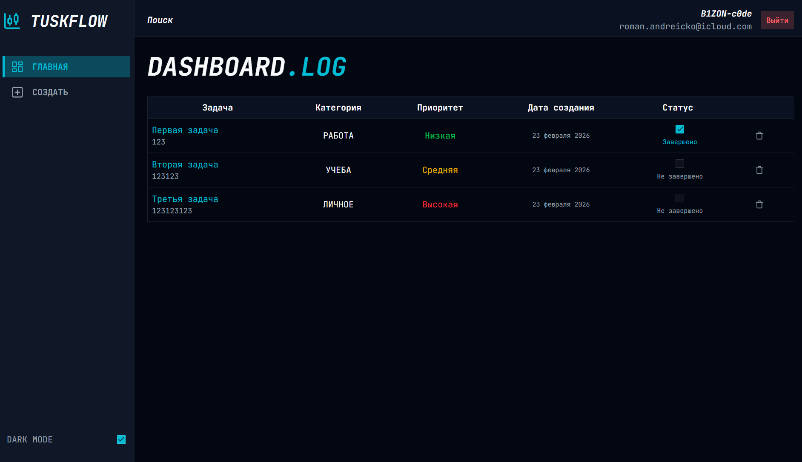
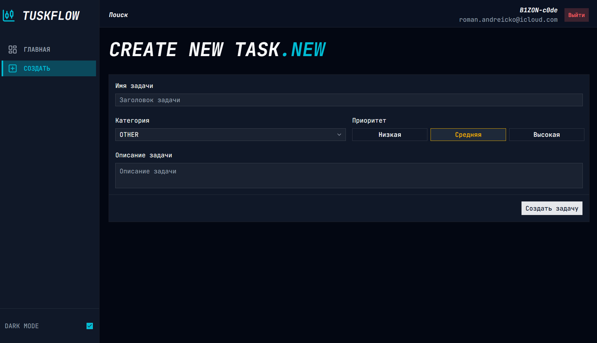
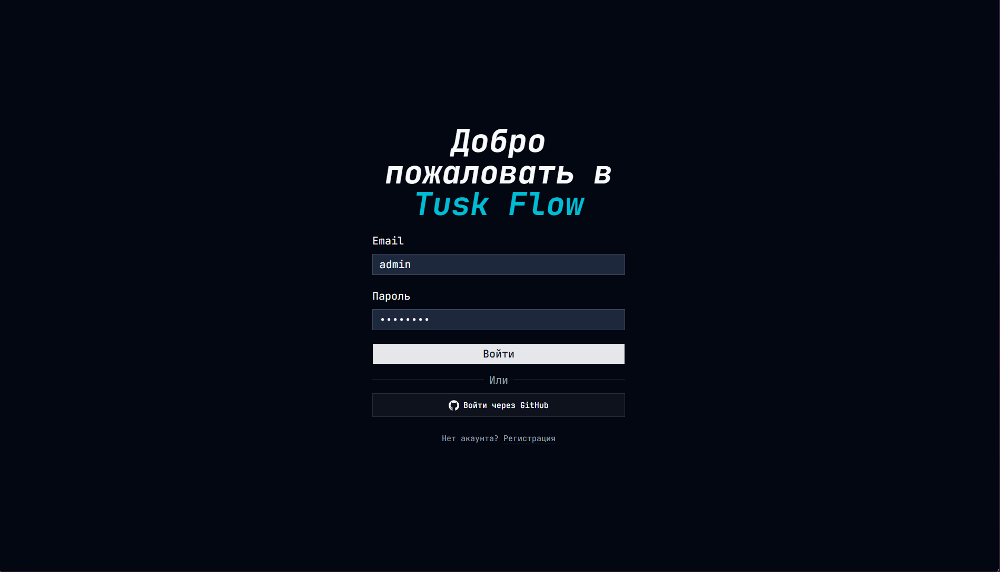

# TuskFlow — простой таск-трекер

Таск-менеджер с аутентификацией, созданный на Next.js. Можно создавать задачи,
фильтровать их по категориям и приоритетам, отмечать выполненное и удалять.
Сделал для себя, чтобы попрактиковаться с Next.js App Router и серверными
действиями.

## О проекте

Обычный таск-трекер, где каждый пользователь видит только свои задачи. Никакой
сложной логики — просто создать, посмотреть список, отметить готовое. Задачи
группируются по категориям (работа/личное/учеба) и приоритетам.

## Зачем я это сделал

Хотелось:

- Разобраться с серверными экшенами в Next.js (до этого делал всё через API
  routes)
- Попробовать Better-Auth — показалось удобнее, чем настраивать NextAuth с нуля
- Поработать с shadcn/ui и кастомизировать его под себя
- Сделать что-то полезное, чтобы закрепить работу с Prisma и PostgreSQL

## Функционал

- Регистрация и вход (email/password или через GitHub)
- Создание задачи с заголовком, описанием, категорией и приоритетом
- Просмотр всех задач в таблице
- Отметка задачи как выполненной (чекбокс)
- Удаление задачи с подтверждением
- Тёмная/светлая тема (переключается в сайдбаре)

## Архитектура / Особенности реализации

Структура более-менее стандартная для Next.js:

- `app/(taskflow)` — защищённая часть с дашбордом и созданием задач
- `app/auth` — страницы логина и регистрации
- `components/shared` — переиспользуемые компоненты, разбиты по папкам (auth,
  create-task, user, app-sidebar и т.д.)
- `lib/actions` — серверные экшены для работы с задачами
- `lib/shema` — схемы валидации (zod) для форм

Из интересного:

- Валидация форм через react-hook-form + zod, для каждого типа поля сделал свой
  контроллер (FieldController, SelectController, ToggleController) — удобно
  переиспользовать
- Кастомные хуки для работы с enum-типами (`typesafeValues`), чтобы не терять
  типизацию при маппинге значений из Prisma
- Better-Auth вместо NextAuth — приятно удивил, меньше бойлерплейта
- Для удаления задачи сделал диалог с подтверждением, чтобы случайно не стереть

## Стек

- **Next.js 15** (App Router)
- **TypeScript**
- **Prisma** + PostgreSQL
- **Better-Auth** — аутентификация
- **React Hook Form** + **Zod** — формы и валидация
- **shadcn/ui** + **Tailwind** — стили
- **TanStack Table** — таблица с задачами

## Как запустить

1. Клонировать репозиторий

```bash
git clone https://github.com/B1ZON-c0de/tusk-flow.git
cd tusk-flow
```

2. Установить зависимости

```bash
pnpm install
# или npm install
```

3. Настроить переменные окружения

```bash
cp .env.example .env.local
```

Заполнить:

- `DATABASE_URL` — строка подключения к PostgreSQL
- `BETTER_AUTH_SECRET` — сгенерировать (можно через `openssl rand -hex 32`)
- `BETTER_AUTH_URL` — `http://localhost:3000` (для разработки)
- Для GitHub OAuth: `GITHUB_CLIENT_ID` и `GITHUB_CLIENT_SECRET` (если нужен вход
  через GitHub)

4. Накатить схему БД

```bash
npx prisma db push
# или npx prisma migrate dev
```

5. Запустить dev-сервер

```bash
pnpm dev
```

## Что можно улучшить

- Пагинацию в таблице задач (если задач станет много)
- Редактирование задачи
- Фильтры по категориям и приоритетам прямо в таблице
- Сортировку по дате создания
- Нормальный поиск (пока заглушка в хедере)
- Добавить возможность загружать файлы к задачам (но это уже избыточно,
  наверное)

## Скриншоты






